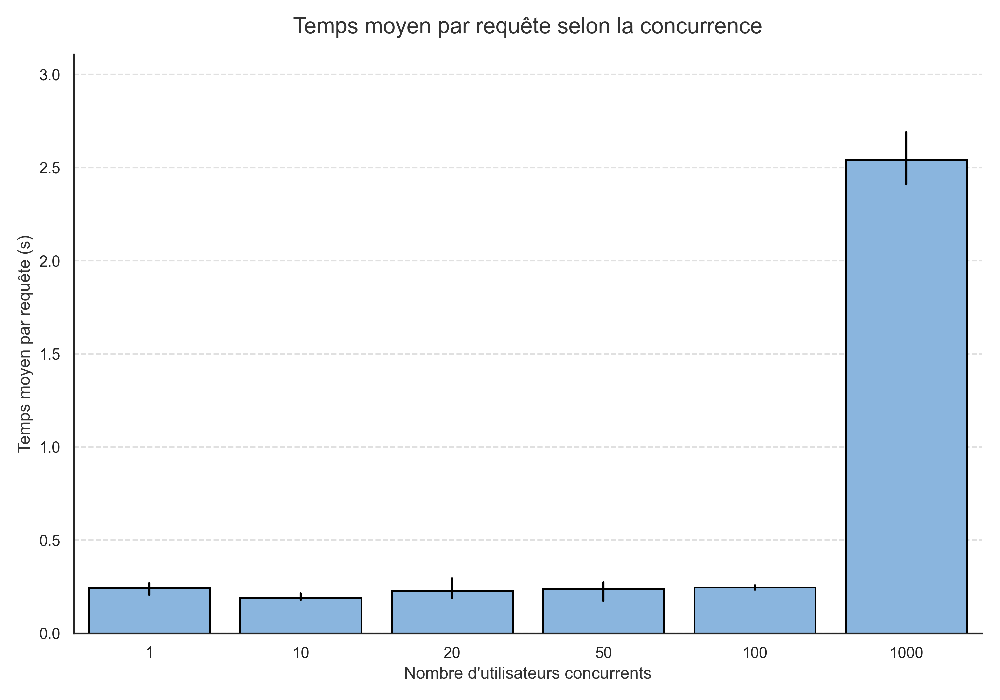
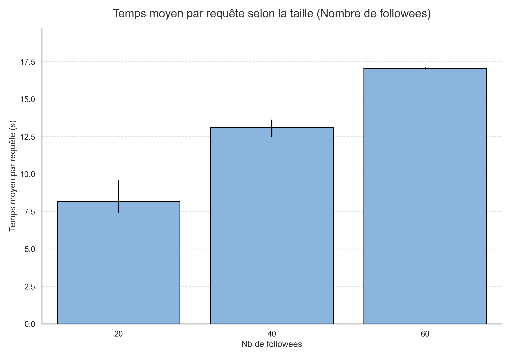

# Rapport de Benchmark - Expériences de Charge TinyInsta

Dans le cadre de ce projet, nous avons réalisé deux expériences de charge (benchmark) à l'aide de l'outil Locust afin d'éprouver l'architecture "Fan-out on Read" utilisée par l'application sur Google App Engine.

## Méthodologie
- **Base de données** : Google Cloud Datastore avec index composite (`author` + `created desc`).
- **Protocole de test** : Pour garantir la validité des résultats et observer l'effet de "Cold Start" (démarrage à froid), toutes les instances App Engine ont été manuellement supprimées via la commande `gcloud app instances delete` entre chaque tir de test. Cela force l'auto-scaler à repartir de zéro et illustre parfaitement le coût de démarrage des serveurs.

**Liens utiles :**
- **Application en ligne** : [https://miage26ga-489814.ew.r.appspot.com](https://miage26ga-489814.ew.r.appspot.com)
- **Dépôt GitHub** : [https://github.com/leoninho-code/massive-gcp](https://github.com/leoninho-code/massive-gcp)

## Expérience 1 : Concurrence (Scale par le trafic)

Pour ce test, la base contient **50 000 posts** répartis sur 1000 utilisateurs (20 abonnements par utilisateur). Le trafic concurrent a varié de 1 à 1000 utilisateurs simultanés.

**Interprétation :**
Les temps de réponse restent globalement acceptables sous une charge modérée (autour de 200-300ms jusqu'à 100 utilisateurs). Cependant, lors du pic massif à 1000 utilisateurs simultanés, le temps moyen s'effondre (plus de 2,5 secondes en moyenne, avec des pics initiaux très longs) et le système génère des erreurs (HTTP 500). Les instances App Engine de base saturent sous le volume de connexions et les temps d'attente réseau vers le Datastore explosent. L'auto-scaler tente de compenser en créant de nombreuses instances (jusqu'à 12), mais la surcharge initiale due au cold start est inévitable.

---

## Expérience 2 : Fan-out (Scale par la taille des données)

Ici, nous avons fixé la charge de trafic à 50 utilisateurs concurrents, mais nous avons doublé la taille de la base (**100 000 posts**) et fait varier le nombre d'abonnements ("followees") : 20, 40, puis 60.

**Interprétation :**
C'est ici que l'anti-pattern majeur de l'architecture se révèle. L'application utilise la méthode du **"Fan-out on Read"** : pour construire une timeline, elle exécute une clause `IN` demandant au Datastore de récupérer tous les posts de *tous* les abonnements à la volée, puis elle les trie en mémoire sur le serveur.
Avec 100 000 posts en base, un utilisateur ayant 60 abonnements oblige le serveur à télécharger environ 6 000 posts (`60 abonnements * 100 posts/auteur`). Avec 50 utilisateurs simultanés demandant cela, les serveurs doivent traiter et trier 300 000 entités Datastore par seconde. L'application s'étouffe totalement, entraînant des temps de réponse désastreux allant de 13 à 17 secondes pour afficher une simple timeline.

---

## Conclusion Générale : Est-ce que l'application "scale" ?

**Non, l'architecture actuelle de l'application ne scale absolument pas.**

Le modèle "Fan-out on Read" couplé à une requête `IN` sur une base NoSQL orientée documents (Datastore) est une aberration architecturale pour un réseau social à grande échelle. Le coût de lecture et de tri en mémoire augmente linéairement avec le nombre d'abonnements ET la quantité de posts stockés dans la base.

Pour qu'un tel système puisse scaler et garder un temps de réponse bas (ex: < 200ms), il faudrait impérativement adopter un modèle de **"Fan-out on Write"** : pré-calculer et stocker la timeline finale de chaque utilisateur directement lors de la création d'un nouveau post. Ainsi, la lecture de la timeline consisterait en un simple accès direct par clé (O(1)), indépendamment du nombre d'abonnements ou du volume total de la base de données.
